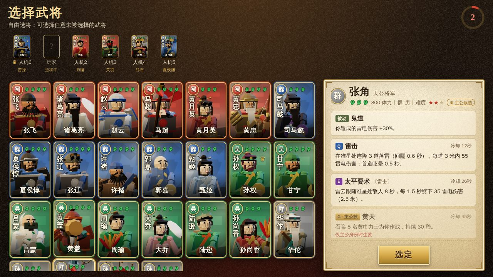
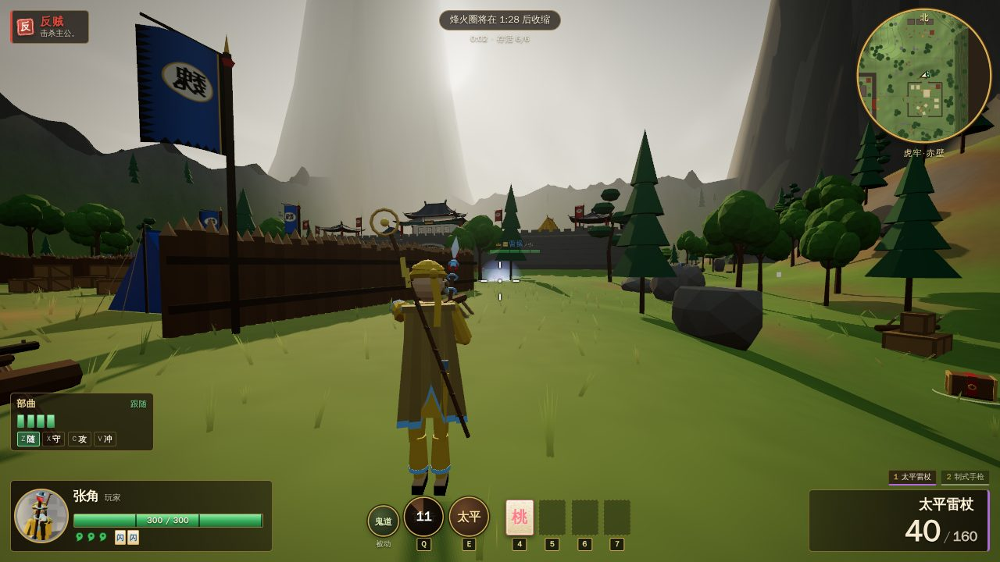
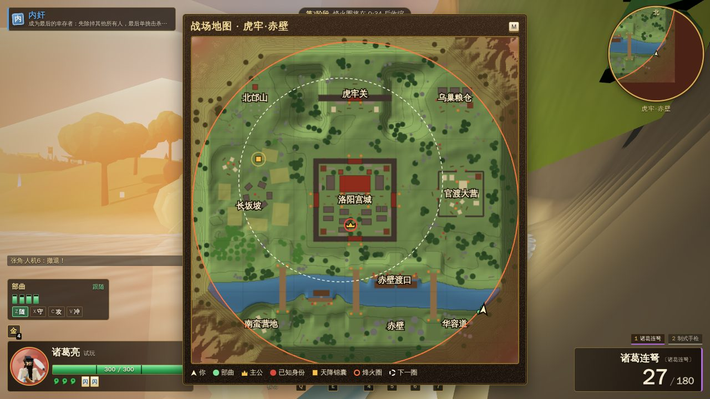
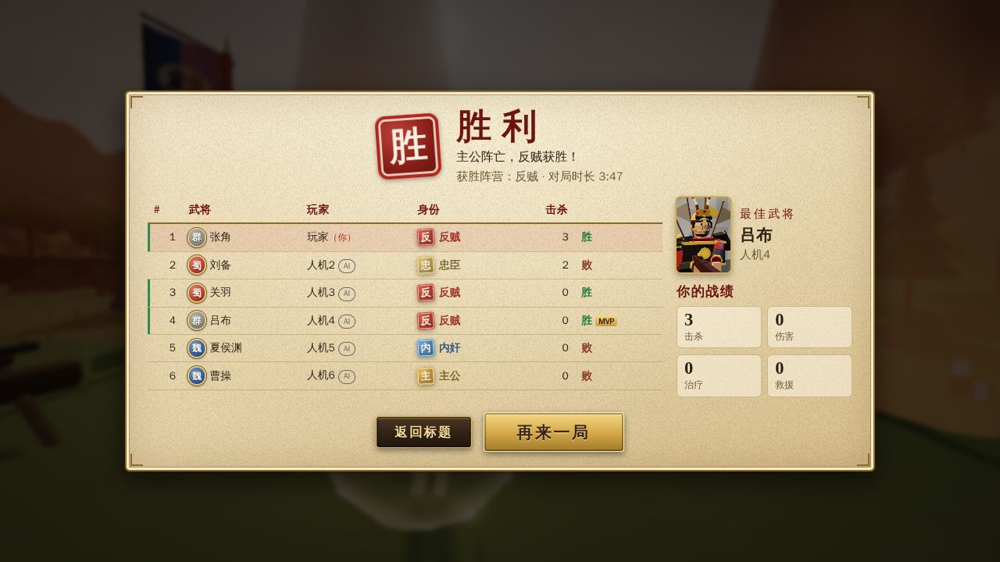

# 三国杀·枪火乱世 · Sanguo Warlords

**三国杀身份局 × 第三人称枪战 × 带兵。** 主公、忠臣、反贼、内奸各怀心思，30 名武将把卡牌技能化作战场技能，
古代兵器化身现代枪械，还要带着自己的部曲、抢锦囊、躲烽火圈。浏览器打开即玩，可单机对战 AI，也可联机。

*A browser 3D third-person hero shooter built on the hidden-role rules of the card game 三国杀 (Sanguosha).
English section below → [English](#english).*


| | |
|---|---|
|  |  |
|  |  |

---

## 这是什么游戏

- **身份局**：主公（公开）、忠臣、反贼、内奸，除主公外身份全部隐藏，死亡时才揭晓。可选「乱世身份」加入影武者、墙头草、赏金猎人。
- **30 名武将**：魏蜀吴群各 7–8 人，每人 1 个被动 + Q / E 两个主动技能，五位主公候选另有主公技（G，只有真主公可用）。
- **古兵器 × 现代枪械**：诸葛连弩是冲锋枪，麒麟弓是反器材狙击枪，方天画戟是三联装火箭筒……
- **带兵**：每名武将带 4 名本势力士兵（主公再 +2），可下令跟随 / 驻守 / 进攻 / 冲锋、标记目标。
- **锦囊与装备**：杀（弹药）、闪、桃、酒、无中生有、过河拆桥、万箭齐发、乐不思蜀……还有八卦阵、藤甲、赤兔、的卢。
- **烽火圈 + 天降锦囊**：地图 320 × 320 米（洛阳宫城、虎牢关、赤壁、官渡大营、长坂坡），安全区逐步缩小，空投里有传说武器。
- 一局 5–8 人（真人 + AI），约 8–12 分钟。所有美术、模型、音效、音乐均为程序生成，无需下载任何素材。

## 怎么玩

| 方式 | 说明 |
|---|---|
| **网页版** | <https://johnsemail88888-droid.github.io/sanguosha-english-atlas/warlords/> —— 打开即玩（推荐 Chrome / Edge / Firefox 最新版） |
| **桌面版** | 在 GitHub [Releases](https://github.com/johnsemail88888-droid/sanguosha-english-atlas/releases) 下载：Windows 便携版 / 安装版（`.exe`）、macOS（`.dmg`）、Linux（`.AppImage`）。桌面版自带局域网服务器。 |
| **离线单文件** | 下载 [`sanguo-warlords-offline.html`](https://johnsemail88888-droid.github.io/sanguosha-english-atlas/warlords/sanguo-warlords-offline.html)（或自行 `npm run build:single` 生成 `dist-single/index.html`），双击即可单机游玩，无需网络。 |

手机横屏也能玩（自动切换触屏操作：左侧摇杆、右侧拖动瞄准、射击 / 开镜 / 跳跃 / 闪避 / 技能按钮；左上角「令 聊 图 战 ☰」再点一次即关闭，长按锦囊栏可查看说明）。

需要 WebGL 2。若标题画面提示「无法启动 3D 画面」，请在浏览器设置里开启硬件加速（图形加速）、更新显卡驱动或浏览器后刷新。

### 操作

| 按键 | 作用 |
|---|---|
| W A S D / 鼠标 | 移动 / 瞄准（点击画面锁定鼠标） |
| 左键 / 右键 | 开火 / 开镜 |
| R | 换弹 |
| Shift | 冲刺 |
| Space | 跳跃 |
| Ctrl / Alt | 闪避翻滚（闪）：2 次充能，8 秒恢复，短暂无敌 |
| Q / E | 武将技能 |
| G | 主公技（仅真主公） |
| F | 拾取 / 打开锦囊箱 / 按住救援倒地队友 |
| 1 / 2 / 滚轮 | 主武器 / 副武器 |
| 4 5 6 7 | 使用锦囊栏 |
| Z X C V | 部曲：跟随 / 驻守 / 进攻 / 冲锋 |
| B / 中键 | 标记准星处目标（士兵集火） |
| T | 跳身份 & 快捷喊话轮盘 |
| Tab / M | 战况（按住）/ 战场地图 |
| Enter / Esc | 聊天 / 菜单（单机自动暂停，联机不暂停；锁定鼠标时浏览器会先释放鼠标，菜单随即打开） |

### 身份与胜负（简要）

| 人数 | 身份分配 |
|---|---|
| 5 | 主公 1 · 忠臣 1 · 反贼 2 · 内奸 1 |
| 6 | 主公 1 · 忠臣 1 · 反贼 3 · 内奸 1 |
| 7 | 主公 1 · 忠臣 2 · 反贼 3 · 内奸 1 |
| 8 | 主公 1 · 忠臣 2 · 反贼 4 · 内奸 1 |

- **主公阵亡**：若场上只剩内奸（中立身份不计）→ **内奸胜**；否则 → **反贼胜**（即使反贼已全部阵亡）。
- **反贼与内奸全部阵亡**且主公存活 → **主公与忠臣胜**。
- **奖惩**：击杀反贼者获得 3 个锦囊；主公误杀忠臣，丢弃全部锦囊、装备与副武器。
- **濒死**：体力归零后倒地 12 秒，队友按住 F 用「桃」救起，或自己饮「酒」自救；流血结束即阵亡并公开身份。
- **乱世身份**：影武者（与主公一同戴冠，但没有主公技）、墙头草（活到最后即随胜方获胜）、赏金猎人（击杀悬赏目标得奖励）。
- 烽火圈最终会缩小到零，一局最长 15 分钟。完整规则见 [`docs/GAME_SPEC.md`](docs/GAME_SPEC.md) 或游戏内「玩法说明」。

### 30 名武将

★ = 主公候选（G 主公技仅在真主公手中生效）。完整数值与技能说明见 **[武将图鉴 docs/HEROES.md](docs/HEROES.md)**（由数据自动生成）。

| 势力 | 武将 | 体力 | 专属武器 | 被动 | Q | E | 主公技 G |
|---|---|---|---|---|---|---|---|
| 蜀 | 刘备 Liu Bei ★ | 4 | 雌雄双股 | 仁德：治疗他人时自己也回复 | 仁德·济民：向准星处武将投掷补给 | 蜀汉旌旗：插旗回血、士兵增伤 | 激将：召集蜀汉义军 |
| 蜀 | 关羽 Guan Yu | 4 | 青龙偃月 | 武圣：近战 / 火焰 / 爆炸伤害 +25% | 青龙斩：冲锋 + 横扫击退 | 义绝：目标沉默并受伤加深 | — |
| 蜀 | 张飞 Zhang Fei | 4 | 丈八蛇矛 | 蛇矛连击：霰弹换弹更快，击杀免弹 | 咆哮：不耗弹、射速提升 | 据水断桥：扇形怒吼击退、眩晕 | — |
| 蜀 | 诸葛亮 Zhuge Liang | 3 | 诸葛连弩 | 观星：定时侦察周围武将 | 八阵图：石阵减速并沉默敌人 | 空城：抚琴无敌 3 秒 | — |
| 蜀 | 赵云 Zhao Yun | 4 | 龙胆亮银枪 | 龙胆：3 次闪避，闪后增伤 | 七进七出：连续冲刺穿阵 | 长坂救主：冲向友军并给护盾 | — |
| 蜀 | 马超 Ma Chao | 4 | 虎头湛金枪 | 马术：常驻骑马提速 | 铁骑：子弹必中、破甲 | 西凉冲锋：长距离冲锋击退 | — |
| 蜀 | 黄月英 Huang Yueying | 3 | 机关连弩 | 集智：用锦囊减少冷却 | 木牛流马：部署自动炮塔 | 奇才：炮塔与士兵射速提升、不耗弹 | — |
| 蜀 | 黄忠 Huang Zhong | 4 | 烈弓 | 烈弓：远距离必中增伤 | 百步穿杨：穿甲箭，穿透至多 3 个目标 | 老当益壮：回血并加速 | — |
| 魏 | 曹操 Cao Cao ★ | 4 | 倚天 | 奸雄：受伤转化为护盾 | 宁教我负天下人：士兵增伤冲锋、吸血 | 望梅止渴：部曲回满，自己回复生命 | 护驾：召唤虎豹骑亲卫 |
| 魏 | 司马懿 Sima Yi | 3 | 寒冰 | 反馈：受伤时偷取锦囊 | 鬼才：减免并反弹子弹伤害 | 狼顾：40 米内武将对你显形 | — |
| 魏 | 夏侯惇 Xiahou Dun | 4 | 青釭 | 刚烈：反弹所受伤害 | 拔矢啖睛：回血并增伤 | 独目怒冲：冲锋眩晕 | — |
| 魏 | 张辽 Zhang Liao | 4 | 制式冲锋枪 | 辽来：背袭增伤 | 突袭：闪现并偷取锦囊 | 威震逍遥津：沉默敌人、吓退士兵 | — |
| 魏 | 许褚 Xu Chu | 4 | 虎贲机枪 | 虎痴：免疫击退 | 裸衣：伤害大增、受伤增加 | 虎卫猛击：震地击飞 | — |
| 魏 | 郭嘉 Guo Jia | 3 | 制式卡宾枪 | 天妒：受重击得锦囊并补弹 | 遗计：呼叫补给空投 | 鬼谋：标记目标受伤加深 | — |
| 魏 | 甄姬 Zhen Ji | 3 | 制式冲锋枪 | 倾国：移动中概率闪避子弹 | 洛神：连续判定抽取锦囊 | 凌波微步：闪现并留下冰霜 | — |
| 魏 | 夏侯渊 Xiahou Yuan | 4 | 制式卡宾枪 | 疾行：移速 +15% | 神速：闪现 + 瞬发连射 | 虎步关右：加速并恢复闪避 | — |
| 吴 | 孙权 Sun Quan ★ | 4 | 古锭 | 权衡：换弹更快 | 制衡：重抽锦囊、瞬间换弹 | 坐断东南：招募士兵 | 救援：你与附近吴国单位减伤 |
| 吴 | 甘宁 Gan Ning | 4 | 锦帆双铃 | 锦帆：移速 +10% | 奇袭：电磁弩剥夺装备并沉默 | 百骑劫营：全队隐身突袭 | — |
| 吴 | 吕蒙 Lü Meng | 4 | 白衣 | 克己：停火后隐身 | 白衣渡江：移动隐身并加速 | 攻心：缴械并偷取锦囊 | — |
| 吴 | 黄盖 Huang Gai | 4 | 贯石 | 赤胆：低血时火焰增伤 | 苦肉：扣血换锦囊与射速 | 诈降火船：火船无人机爆炸 | — |
| 吴 | 周瑜 Zhou Yu | 3 | 朱雀羽扇 | 英姿：换弹速度 +25% | 反间：魅惑敌人自相残杀 | 火烧赤壁：直线燃烧弹轰炸 | — |
| 吴 | 大乔 Da Qiao | 3 | 制式冲锋枪 | 流离：转移部分子弹伤害 | 国色：乐不思蜀，令敌起舞 | 安娴：治疗周围友军 | — |
| 吴 | 陆逊 Lu Xun | 3 | 制式冲锋枪 | 谦逊 / 连营：免疫魅惑、起舞与偷取；弹空自动装填半匣 | 火烧连营：一线火海 | 燎原：6 秒射击不耗弹 | — |
| 吴 | 孙尚香 Sun Shangxiang | 3 | 枭姬弓 | 枭姬：失去装备时获得增益 | 结姻：与男性武将互相治疗 | 弓腰姬：扇形爆炸箭 | — |
| 群 | 华佗 Hua Tuo | 3 | 青囊药镖 | 急救：救人只需 0.5 秒并额外回复 | 青囊：持续治疗并驱散 | 麻沸散：毒气眩晕减速 | — |
| 群 | 吕布 Lü Bu | 4 | 无双战铳 | 无双：伤害无法闪避、无视一半护盾 | 方天画戟：360° 旋斩击退 | 辕门射戟：精准重击眩晕 | — |
| 群 | 貂蝉 Diaochan | 3 | 雌雄双股 | 闭月：脱战后回血 | 离间：令两名敌人互相攻击 | 连环计：锁链连结多名敌人 | — |
| 群 | 张角 Zhang Jiao ★ | 3 | 太平雷杖 | 鬼道：雷电伤害 +30% | 雷击：连落三道天雷 | 太平要术：雷云追击目标 | 黄天：召唤黄巾力士 |
| 群 | 袁绍 Yuan Shao ★ | 4 | 制式卡宾枪 | 名门：带兵 +1 | 乱击：箭雨覆盖 | 四世三公：召唤弩手 | 血裔（被动）：群雄越多体力越高 |
| 群 | 孟获 Meng Huo | 4 | 蛮王双管 | 祸首 / 再起：南蛮不攻击你；每局一次濒死时以半血站起 | 南蛮入侵：召唤南蛮勇士 | 象兵：战象冲锋践踏 | — |

## 联机

标题画面 →「联机对战」，选择连接方式：

### 1. 公共 P2P（房间码）
主机「创建房间」后得到 5 位房间码（或复制邀请链接——链接里带着连接方式和自定义服务器，朋友打开即用同样的方式连接），朋友「加入房间」输入房间码即可。刷新页面（F5）会用原来的方式自动重新加入。通过 WebRTC 直连，
使用公共 PeerJS 信令服务器，无需自己架服务器。空位由 AI 补齐，掉线的玩家由 AI 接管，重连后可以收回座位。

### 2. 局域网 / 自建服务器（服务器模式）
一个端口同时提供：游戏网页、WebSocket 中继（`/ws`）和 PeerJS 信令（`/peerjs`）。

- **桌面版**：已内置服务器。菜单「游戏 → 局域网联机地址…」或联机界面会列出本机局域网地址（带复制按钮），默认使用「服务器」模式。
- **命令行**：
  ```bash
  cd warlords
  npm ci
  npm run build      # 生成 dist/
  npm run server     # 默认端口 8787，可用 PORT=9000 npm run server 修改
  ```
  同一 Wi-Fi / 路由器下的朋友用浏览器打开终端里显示的 `http://192.168.x.x:8787`，选择「服务器」模式，一人创建房间、其他人输入房间码即可——从这个服务器打开的网页会自动使用同源中继，无需任何设置。

### 3. 在云服务器（VPS）上部署（适合中国大陆玩家）
公共 PeerJS 云与部分 STUN 在国内可能较慢或无法连接，推荐在国内云服务器上自建：

```bash
# Node.js 22 LTS（构建需要 ≥ 20.19）
git clone https://github.com/johnsemail88888-droid/sanguosha-english-atlas.git
cd sanguosha-english-atlas/warlords
npm ci && npm run build
PORT=8787 HOST=0.0.0.0 npm run server   # 生产环境建议用 systemd / pm2 常驻
```

- 在云厂商安全组 / 防火墙放行 TCP 8787，玩家访问 `http://<服务器IP>:8787` 并选择「服务器」模式即可联机。所有流量经服务器中继，不受 NAT 限制。
- 想用域名 + HTTPS：用 Nginx / Caddy 反向代理到 8787，并转发 WebSocket（`Upgrade` 头）。HTTPS 页面必须使用 `wss://`。
  使用国内服务器的 80 / 443 端口配合域名需要 ICP 备案；未备案时可直接使用「IP:端口」访问。
- 也可以只把它当信令服务器：其他玩家在「设置 → 网络」中填写 PeerJS 服务器 `host=<服务器IP> port=8787 path=/peerjs secure=关`，
  或填写 WebSocket 中继地址 `ws://<服务器IP>:8787/ws`，继续使用 GitHub Pages 上的网页版。

### TURN 说明
P2P 模式需要双方能打洞。对称型 NAT、手机 4G/5G（运营商级 NAT）或严格的公司网络下可能连不上：
请改用「服务器」模式（WebSocket 中继总能连通），或自建 TURN 服务器（如 coturn），在「设置 → 网络」中填写 TURN 地址、用户名和密码。
内置的 STUN 列表包含国内可用的服务器（小米、哔哩哔哩）以及 Cloudflare / Google。

## 开发

需要 Node.js 22 LTS（Vite 8 要求 ≥ 20.19 或 ≥ 22.12）。所有命令在 `warlords/` 目录下执行。

| 命令 | 作用 |
|---|---|
| `npm ci` | 安装依赖 |
| `npm run dev` | 开发服务器（http://localhost:5173） |
| `npm run build` | 类型检查 + 生产构建到 `dist/` |
| `npm run build:single` | 单文件离线版 `dist-single/index.html` |
| `npm run typecheck` | TypeScript 检查 |
| `npm test` | 单元测试（vitest，模拟层完全无头运行） |
| `npm run e2e` | 端到端测试（Playwright + SwiftShader：单机完整流程、三人 WebSocket 联机、`file://` 离线版、手机触屏） |
| `npm run server` | 局域网 / 自建服务器（端口 8787） |
| `npm run electron` | 以桌面应用运行 |
| `npm run dist:win` / `dist:mac` / `dist:linux` | 打包桌面版到 `release/` |

- 调试：在网址后加 `?debug=1` 会暴露 `window.__sgwl`（当前会话、视图、本地英雄、事件统计、加载耗时，以及仅限本地单人练习的作弊：`cheats.timeScale(4)`、`cheats.god()`、`cheats.give('tao')`、`cheats.teleport(x, z)` 等；联机房主与客人均不可用），供自动化测试与试玩使用。
- e2e 默认使用 `/opt/pw-browsers/chromium`，可用 `CHROMIUM_PATH` 覆盖；`SGWL_E2E_SKIP_BUILD=1` 复用上次的测试构建。

### 项目结构

```
warlords/
├─ index.html              入口页面
├─ src/
│  ├─ main.ts              应用入口：连接 UI、网络会话、渲染与音频
│  ├─ core/                契约：类型、数学、随机数、地图数据
│  ├─ data/                内容：30 武将、武器、锦囊 / 装备、士兵、身份、状态、掉落表
│  ├─ sim/                 无头权威模拟（物理、战斗、状态、规则、烽火圈、掉落、士兵、AI、地图生成）
│  ├─ net/                 会话与传输：本地回环、PeerJS、WebSocket；主机权威 + 客户端预测 / 插值
│  ├─ render/              three.js 渲染：地形、建筑、程序化角色与武器、动画、特效、第三人称相机
│  ├─ ui/                  DOM 界面：各个画面、HUD、触屏操作、中英双语
│  ├─ audio/               程序化 WebAudio 音效与音乐
│  └─ game/                输入、用户设置、会话契约、调试钩子
├─ server/                 Node 服务器：静态网页 + WebSocket 中继 + PeerJS 信令
├─ electron/               桌面版外壳（内置服务器）
├─ tests/unit/             vitest 单元测试
├─ tests/e2e/              Playwright 端到端测试
└─ docs/                   GAME_SPEC.md（设计文档）、HEROES.md（武将图鉴）
```

## 致谢与许可

- 本项目为**粉丝自制、非商业**作品，与 **游卡桌游（Yoka Games）** 及「三国杀」官方**没有任何关联**，也未获其授权或认可。「三国杀」名称及相关规则归其权利人所有，此处仅用于识别与致敬。
- 游戏内所有美术（模型、贴图、界面图案）、音效与音乐均由代码**程序化生成**，未使用任何官方素材。
- 源代码许可见仓库根目录 [`LICENSE.md`](../LICENSE.md)（允许个人、学习与非商业用途）。第三方依赖：three.js、PeerJS、ws、peer（均为 MIT 许可）。

---

<a id="english"></a>

## English

**Sanguo Warlords** is a browser 3D third-person hero shooter built on the hidden-role game of 三国杀 (Sanguosha):
the Lord is public, Loyalists, Rebels and the Traitor are hidden until they die. 30 heroes turn their card skills
into action abilities (passive + Q + E, lord skill on G), ancient weapons become modern guns, every hero leads a
squad of soldiers, and a shrinking beacon-fire zone plus airdrops keep 5–8 player matches (humans + bots) to about
8–12 minutes. Everything — models, textures, sound, music — is generated procedurally in code.

### How to play
- **Web:** <https://johnsemail88888-droid.github.io/sanguosha-english-atlas/warlords/> (latest Chrome / Edge / Firefox; phones in landscape get touch controls).
- **Desktop:** download from GitHub [Releases](https://github.com/johnsemail88888-droid/sanguosha-english-atlas/releases) — Windows portable / installer, macOS `.dmg`, Linux `.AppImage`. The desktop app embeds the LAN server.
- **Offline single file:** [`sanguo-warlords-offline.html`](https://johnsemail88888-droid.github.io/sanguosha-english-atlas/warlords/sanguo-warlords-offline.html) (or `npm run build:single` → `dist-single/index.html`); double-click to play single player without a network.
- Switch the UI language on the title screen (中文 / English).
- Needs WebGL 2. If the title screen says "3D graphics can't start", turn on hardware acceleration in the browser settings, update the graphics driver or browser, and reload.

### Controls
WASD move · mouse aim (click to lock the pointer) · LMB fire · RMB aim down sights · R reload · Shift sprint ·
Space jump · Ctrl/Alt dodge roll (2 charges) · Q/E abilities · G lord skill (real Lord only) · F pick up / open /
hold to revive · 1/2 or wheel switch weapon · 4–7 items · Z/X/C/V squad follow/hold/attack/charge · B or MMB mark ·
T claim & quick-chat wheel · Tab scoreboard · M map · Enter chat · Esc menu (single player pauses while the menu is
open; online matches keep running — when the browser releases the pointer on Esc the menu opens by itself).

### Roles & winning
5–8 players: 1 Lord, 1–2 Loyalists, 2–4 Rebels, 1 Traitor (chaos mode adds Body Double, Opportunist and Bounty Hunter).
If the Lord dies, the Traitor wins when they are the only non-neutral survivor, otherwise the Rebels win. If every
Rebel and the Traitor die while the Lord lives, Lord + Loyalists win. Killing a Rebel rewards 3 items; a Lord who
kills a Loyalist drops everything. At 0 HP you are downed for 12 s — an ally can revive you with a Peach (hold F),
or drink Wine to get up yourself. Full rules: [`docs/GAME_SPEC.md`](docs/GAME_SPEC.md).

### Heroes
All 30 heroes with every number and ability: **[docs/HEROES.md](docs/HEROES.md)** (generated from the game data).

| Hero | Passive | Q | E | Lord (G) |
|---|---|---|---|---|
| Liu Bei ★ | Benevolence | Relief Supplies | Banner of Han | Rouse |
| Guan Yu | Saint of War | Green Dragon Cleave | Righteous Severance | — |
| Zhang Fei | Serpent Flurry | Roar | Thunder at the Bridge | — |
| Zhuge Liang | Stargazing | Eight Trigrams Maze | Empty Fort | — |
| Zhao Yun | Dragon Courage | Seven In, Seven Out | Rescue at Changban | — |
| Ma Chao | Horsemanship | Iron Cavalry | Xiliang Charge | — |
| Huang Yueying | Gathering Wisdom | Wooden Ox Turret | Genius Inventor | — |
| Huang Zhong | Fierce Bow | Hundred-Pace Shot | Old Soldier's Vigor | — |
| Cao Cao ★ | Villainous Hero | Betray the World | Plums Quench Thirst | Escort |
| Sima Yi | Retaliation | Ghostly Talent | Wolf's Glance | — |
| Xiahou Dun | Unyielding | Eat the Eye | One-Eyed Charge | — |
| Zhang Liao | Liao Is Coming | Surprise Raid | Terror of Xiaoyao Ford | — |
| Xu Chu | Tiger Fool | Bare-Chested | Tiger Guard Slam | — |
| Guo Jia | Envy of Heaven | Legacy Stratagem | Ghostly Scheme | — |
| Zhen Ji | Nation-Toppling Beauty | Goddess of the Luo | Graceful Steps | — |
| Xiahou Yuan | Swift March | Godspeed | Tiger Stride | — |
| Sun Quan ★ | Deliberation | Balance of Power | Master of the Southeast | Rescue |
| Gan Ning | Brocade Sails | EMP Raid | Hundred Riders Raid | — |
| Lü Meng | Self-Restraint | Crossing in White | Mind Assault | — |
| Huang Gai | Burning Loyalty | Self-Injury | Fire Ship Gambit | — |
| Zhou Yu | Heroic Bearing | Sow Discord | Red Cliffs Inferno | — |
| Da Qiao | Displacement | National Beauty | Serenity | — |
| Lu Xun | Modesty / Continuous Camps | Burning Camps | Wildfire | — |
| Sun Shangxiang | Warrior Princess | Marriage Bond | Arrow Fan | — |
| Hua Tuo | First Aid | Green Satchel | Anesthetic Gas | — |
| Lü Bu | Peerless | Sky Piercer Sweep | Shot at the Camp Gate | — |
| Diaochan | Moon Eclipse | Sow Dissension | Chain Stratagem | — |
| Zhang Jiao ★ | Ghostly Way | Lightning Strike | Way of Peace | Yellow Heaven |
| Yuan Shao ★ | Noble Lineage | Chaotic Volley | Four Generations of Nobility | Noble Bloodline (passive) |
| Meng Huo | Chief Culprit / Resurgence | Barbarian Invasion | Elephant Corps | — |

### Online play
- **Public P2P (room code):** Play Online → Public P2P → Host a room; friends join with the 5-character code or the
  invite link (it carries the connection mode and any custom server, so friends connect the same way; a reload (F5)
  rejoins the same way too). WebRTC through the public PeerJS signalling cloud; empty seats are bots, dropped players are taken over
  by a bot and can rejoin their seat.
- **LAN / self-hosted server:** `npm run build && npm run server` (port 8787, `PORT=` to change) serves the game, a
  WebSocket relay on `/ws` and PeerJS signalling on `/peerjs` from one port. Friends on the same network open
  `http://<your-LAN-IP>:8787`, choose **Server** mode and join by room code — pages served by the server use the
  same-origin relay automatically. The desktop app has the server built in: its online screen lists your LAN
  addresses with copy buttons (also under the menu 游戏 → 局域网联机地址…).
- **VPS (recommended for players in mainland China,** where the public PeerJS cloud and some STUN servers are slow or
  blocked): clone the repo on a server, `npm ci && npm run build && PORT=8787 npm run server`, open TCP 8787 in the
  firewall and let players use `http://<server-ip>:8787` in Server mode. For a domain + HTTPS put Nginx/Caddy in front
  (forward WebSocket upgrades; HTTPS pages need `wss://`); mainland-China servers need ICP filing to serve a domain on
  80/443. The same server can also act as PeerJS signalling (`Settings → Network`: host = server IP, port 8787,
  path `/peerjs`, secure off) or as a relay URL (`ws://<server-ip>:8787/ws`) for the GitHub Pages build.
- **TURN:** P2P needs NAT hole-punching; behind symmetric NAT / mobile carrier-grade NAT / strict corporate networks it
  can fail. Use Server mode (the WebSocket relay always works) or run a TURN server (e.g. coturn) and enter its URL,
  user and password in Settings → Network. Built-in STUN servers include China-reachable ones (Xiaomi, Bilibili) plus
  Cloudflare and Google.

### Development
Node.js 22 LTS (Vite 8 needs ≥ 20.19 / 22.12). In `warlords/`: `npm ci`, `npm run dev`, `npm run build`, `npm run build:single`,
`npm run typecheck`, `npm test` (vitest), `npm run e2e` (Playwright on SwiftShader: full single-player flow, three
browsers joining over the WebSocket relay, the `file://` single-file build, phone touch controls), `npm run server`,
`npm run electron`, `npm run dist:win|mac|linux`. Append `?debug=1` to the URL to get `window.__sgwl` (session,
view, local hero, event counters, load timings and — in local single-player matches only, never online — cheats such as `cheats.timeScale(4)`,
`cheats.god()`, `cheats.give('tao')`) for automated play-testing. Layout: `src/core` contracts · `src/data` content · `src/sim`
headless authoritative simulation + AI + map generator · `src/net` sessions & transports · `src/render` three.js ·
`src/ui` DOM screens & HUD · `src/audio` procedural audio · `src/game` input/settings/debug · `server/` Node server ·
`electron/` desktop shell · `tests/` unit + e2e · `docs/` design spec and hero guide.

### Credits & licence
Fan-made and non-commercial. **Not affiliated with, endorsed or sponsored by Yoka Games (游卡桌游)**; 三国杀 /
Sanguosha names and rules belong to their respective owners and are referenced for identification only. All art,
sound and music in the game are generated procedurally — no official assets are used. Source code: see
[`LICENSE.md`](../LICENSE.md) (personal, educational and non-commercial use). Dependencies: three.js, PeerJS, ws,
peer (MIT).
