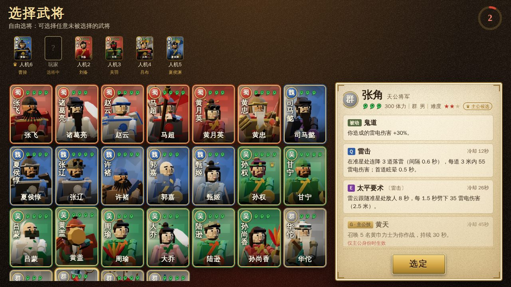
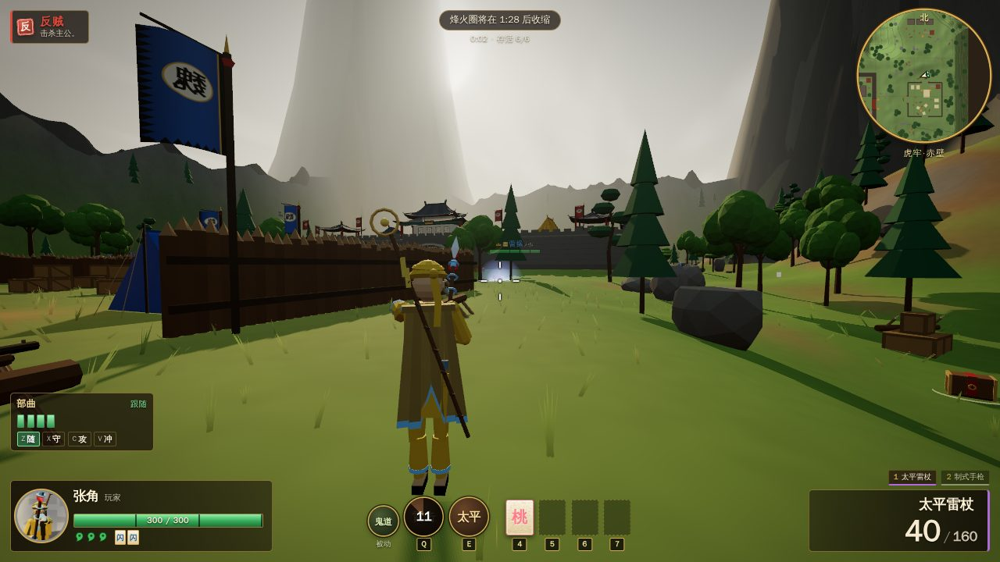
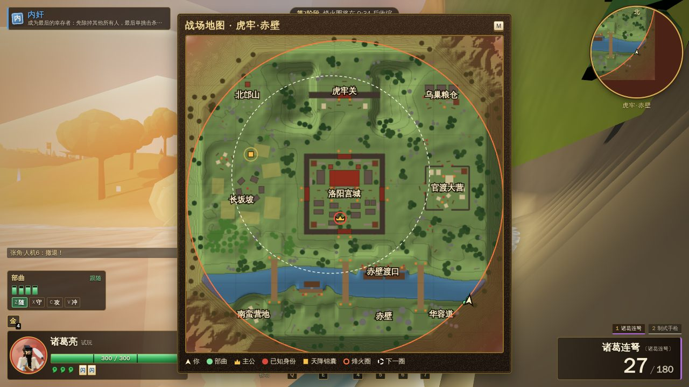
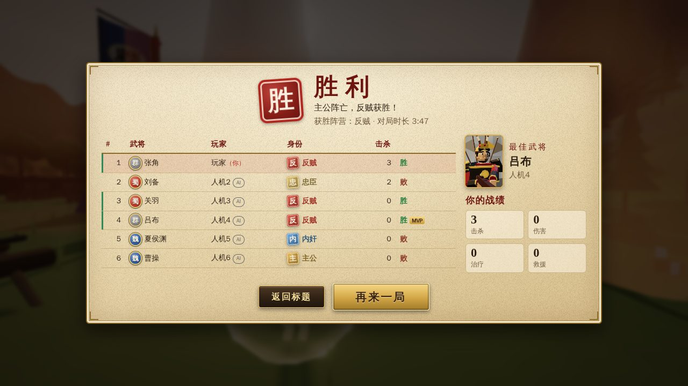

# 三国杀·枪火乱世 · Sanguo Warlords

**三国杀身份局 × 第三人称枪战 × 带兵。** 主公、忠臣、反贼、内奸各怀心思，30 名武将把卡牌技能化作战场技能，
古代兵器化身现代枪械，还要带着自己的部曲、抢锦囊、躲烽火圈。浏览器打开即玩，可单机对战 AI，也可联机。

*A browser 3D third-person hero shooter built on the hidden-role rules of the card game 三国杀 (Sanguosha).
English section below → [English](#english).*


| | |
|---|---|
|  |  |
|  |  |

---

## 这是什么游戏

- **身份局**：主公（公开）、忠臣、反贼、内奸，除主公外身份全部隐藏，死亡时才揭晓。可选「乱世身份」加入影武者、墙头草、赏金猎人。
- **30 名武将**：魏蜀吴群各 7–8 人，每人 1 个被动 + Q / E 两个主动技能，五位主公候选另有主公技（G，只有真主公可用）。
- **古兵器 × 现代枪械**：诸葛连弩是冲锋枪，麒麟弓是反器材狙击枪，方天画戟是三联装火箭筒……
- **带兵**：每名武将带 4 名本势力士兵（主公再 +2），可下令跟随 / 驻守 / 进攻 / 冲锋、标记目标。
- **锦囊与装备**：杀（弹药）、闪、桃、酒、无中生有、过河拆桥、万箭齐发、乐不思蜀……还有八卦阵、藤甲、赤兔、的卢。
- **烽火圈 + 天降锦囊**：地图 320 × 320 米（洛阳宫城、虎牢关、赤壁、官渡大营、长坂坡），安全区逐步缩小，空投里有传说武器。
- 一局 5–8 人（真人 + AI），约 8–12 分钟。武将、兵卒、武器、战马的 3D 模型，立绘、身份牌、锦囊与技能图标、加载画面和地形贴图为 AI 生成的美术（随网页版一起下载，约 30 MB）；音效由代码实时合成；背景音乐默认在线播放开源项目「无名杀」的曲目（可在 设置 → 声音 → 配乐 改为原创国风配乐，联系不上时自动改用），离线单文件版不含这些美术，自动改用程序化生成的模型与图案，玩法完全相同。

## 怎么玩

| 方式 | 说明 |
|---|---|
| **网页版** | <https://johnsemail88888-droid.github.io/sanguosha-english-atlas/warlords/> —— 打开即玩（推荐 Chrome / Edge / Firefox 最新版） |
| **桌面版** | 在 GitHub [Releases](https://github.com/johnsemail88888-droid/sanguosha-english-atlas/releases/latest) 下载。**Windows 推荐安装版 `…-Windows-setup.exe`：装一次，以后自动更新**（后台下载新版本，退出游戏时安装，标题页也可点「重启并更新」）；便携版 `…-Windows-portable.exe` 和 macOS（`.dmg`）有新版本时标题页会提示「有新版本 build N · 下载」；Linux（`.AppImage`）同样自动更新。标题页写着「测试版 v0.1.0」的旧桌面版不会自动更新，需重新下载一次。联机零设置：打开就连官方服务器。**不会再「版本不同」**：桌面版启动时先问官方服务器在跑哪个版本——和本机相同就用本机自带的页面（快、离线也能玩），不同就直接打开官方服务器的页面；开着游戏时服务器更新了，遇到版本不同会自动切换并重新进入同一个房间（网页版同理：自动打开官方服务器的页面并带上房间号）。官方服务器的页面只拿到你的偏好设置（名字、语言、画质等），拿不到服务器密钥、局域网地址；它打不开或卡在加载时，桌面版会自动退回本机页面。桌面版自带局域网服务器。应用未签名：Windows 首次运行点「更多信息 → 仍要运行」，并在防火墙提示里允许「专用网络」（否则朋友连不进来）；macOS 15+ 在「系统设置 → 隐私与安全性」点「仍要打开」。 |
| **离线单文件** | 下载 [`sanguo-warlords-offline.html`](https://johnsemail88888-droid.github.io/sanguosha-english-atlas/warlords/sanguo-warlords-offline.html)（或自行 `npm run build:single` 生成 `dist-single/index.html`），双击即可单机游玩，无需网络。 |

手机横屏也能玩（自动切换触屏操作：左侧摇杆、右侧拖动瞄准、射击 / 开镜 / 跳跃 / 闪避 / 技能按钮；左上角「令 聊 图 战 ☰」再点一次即关闭，长按锦囊栏可查看说明）。

需要 WebGL 2。若标题画面提示「无法启动 3D 画面」，请在浏览器设置里开启硬件加速（图形加速）、更新显卡驱动或浏览器后刷新。

### 操作

| 按键 | 作用 |
|---|---|
| W A S D / 鼠标 | 移动 / 瞄准（点击画面锁定鼠标） |
| 左键 / 右键 | 开火 / 开镜 |
| R | 换弹 |
| Shift | 冲刺 |
| Space | 跳跃 |
| Ctrl / Alt | 闪避翻滚（闪）：2 次充能，8 秒恢复，短暂无敌 |
| Q / E | 武将技能 |
| G | 主公技（仅真主公） |
| F | 拾取 / 打开锦囊箱 / 按住救援倒地队友 |
| 1 / 2 / 滚轮 | 主武器 / 副武器 |
| 4 5 6 7 | 使用锦囊栏 |
| Z X C V | 部曲：跟随 / 驻守 / 进攻 / 冲锋 |
| B / 中键 | 标记准星处目标（士兵集火） |
| H | 第一人称 / 第三人称视角切换（键鼠默认第一人称，触屏默认第三人称） |
| T | 跳身份 & 快捷喊话轮盘 |
| Tab / M | 战况（按住）/ 战场地图 |
| Enter / Esc | 聊天 / 菜单（单机自动暂停，联机不暂停；锁定鼠标时浏览器会先释放鼠标，菜单随即打开） |

### 身份与胜负（简要）

| 人数 | 身份分配 |
|---|---|
| 5 | 主公 1 · 忠臣 1 · 反贼 2 · 内奸 1 |
| 6 | 主公 1 · 忠臣 1 · 反贼 3 · 内奸 1 |
| 7 | 主公 1 · 忠臣 2 · 反贼 3 · 内奸 1 |
| 8 | 主公 1 · 忠臣 2 · 反贼 4 · 内奸 1 |

- **主公阵亡**：若场上只剩内奸（中立身份不计）→ **内奸胜**；否则 → **反贼胜**（即使反贼已全部阵亡）。
- **反贼与内奸全部阵亡**且主公存活 → **主公与忠臣胜**。
- **奖惩**：击杀反贼者获得 3 个锦囊；主公误杀忠臣，丢弃全部锦囊、装备与副武器。
- **濒死**：体力归零后倒地 30 秒（同一条命再倒地 20 秒、之后 12 秒），队友按住 F 用「桃」救起，或自己饮「酒」自救，身边没有敌人时部曲会来包扎；流血结束即阵亡并公开身份，锦囊掉落在尸体旁；60 秒内队友可在尸体旁按住 F「招魂」把你召回（每局一次）。
- **乱世身份**：影武者（与主公一同戴冠，但没有主公技）、墙头草（活到最后即随胜方获胜）、赏金猎人（击杀悬赏目标得奖励）。
- 烽火圈最终会缩小到零，一局最长 15 分钟。完整规则见 [`docs/GAME_SPEC.md`](docs/GAME_SPEC.md) 或游戏内「玩法说明」。

### 30 名武将

★ = 主公候选（G 主公技仅在真主公手中生效）。完整数值与技能说明见 **[武将图鉴 docs/HEROES.md](docs/HEROES.md)**（由数据自动生成）。

| 势力 | 武将 | 体力 | 专属武器 | 被动 | Q | E | 主公技 G |
|---|---|---|---|---|---|---|---|
| 蜀 | 刘备 Liu Bei ★ | 4 | 雌雄双股 | 仁德：治疗他人时自己也回复 | 仁德·济民：向准星处武将投掷补给 | 蜀汉旌旗：插旗回血、士兵增伤 | 激将：召集蜀汉义军 |
| 蜀 | 关羽 Guan Yu | 4 | 青龙偃月 | 武圣：近战 / 火焰 / 爆炸伤害 +25% | 青龙斩：冲锋 + 横扫击退 | 义绝：目标沉默并受伤加深 | — |
| 蜀 | 张飞 Zhang Fei | 4 | 丈八蛇矛 | 蛇矛连击：霰弹换弹更快，击杀免弹 | 咆哮：不耗弹、射速提升 | 据水断桥：扇形怒吼击退、眩晕 | — |
| 蜀 | 诸葛亮 Zhuge Liang | 3 | 诸葛连弩 | 观星：定时侦察周围武将 | 八阵图：石阵减速并沉默敌人 | 空城：抚琴无敌 3 秒 | — |
| 蜀 | 赵云 Zhao Yun | 4 | 龙胆亮银枪 | 龙胆：3 次闪避，闪后增伤 | 七进七出：连续冲刺穿阵 | 长坂救主：冲向友军并给护盾 | — |
| 蜀 | 马超 Ma Chao | 4 | 虎头湛金枪 | 马术：常驻骑马提速 | 铁骑：子弹必中、破甲 | 西凉冲锋：长距离冲锋击退 | — |
| 蜀 | 黄月英 Huang Yueying | 3 | 机关连弩 | 集智：用锦囊减少冷却 | 木牛流马：部署自动炮塔 | 奇才：炮塔与士兵射速提升、不耗弹 | — |
| 蜀 | 黄忠 Huang Zhong | 4 | 烈弓 | 烈弓：远距离必中增伤 | 百步穿杨：穿甲箭，穿透至多 3 个目标 | 老当益壮：回血并加速 | — |
| 魏 | 曹操 Cao Cao ★ | 4 | 倚天 | 奸雄：受伤转化为护盾 | 宁教我负天下人：士兵增伤冲锋、吸血 | 望梅止渴：部曲回满，自己回复生命 | 护驾：召唤虎豹骑亲卫 |
| 魏 | 司马懿 Sima Yi | 3 | 寒冰 | 反馈：受伤时偷取锦囊 | 鬼才：减免并反弹子弹伤害 | 狼顾：40 米内武将对你显形 | — |
| 魏 | 夏侯惇 Xiahou Dun | 4 | 青釭 | 刚烈：反弹所受伤害 | 拔矢啖睛：回血并增伤 | 独目怒冲：冲锋眩晕 | — |
| 魏 | 张辽 Zhang Liao | 4 | 制式冲锋枪 | 辽来：背袭增伤 | 突袭：闪现并偷取锦囊 | 威震逍遥津：沉默敌人、吓退士兵 | — |
| 魏 | 许褚 Xu Chu | 4 | 虎贲机枪 | 虎痴：免疫击退 | 裸衣：伤害大增、受伤增加 | 虎卫猛击：震地击飞 | — |
| 魏 | 郭嘉 Guo Jia | 3 | 制式卡宾枪 | 天妒：受重击得锦囊并补弹 | 遗计：呼叫补给空投 | 鬼谋：标记目标受伤加深 | — |
| 魏 | 甄姬 Zhen Ji | 3 | 制式冲锋枪 | 倾国：移动中概率闪避子弹 | 洛神：连续判定抽取锦囊 | 凌波微步：闪现并留下冰霜 | — |
| 魏 | 夏侯渊 Xiahou Yuan | 4 | 制式卡宾枪 | 疾行：移速 +15% | 神速：闪现 + 瞬发连射 | 虎步关右：加速并恢复闪避 | — |
| 吴 | 孙权 Sun Quan ★ | 4 | 古锭 | 权衡：换弹更快 | 制衡：重抽锦囊、瞬间换弹 | 坐断东南：招募士兵 | 救援：你与附近吴国单位减伤 |
| 吴 | 甘宁 Gan Ning | 4 | 锦帆双铃 | 锦帆：移速 +10% | 奇袭：电磁弩剥夺装备并沉默 | 百骑劫营：全队隐身突袭 | — |
| 吴 | 吕蒙 Lü Meng | 4 | 白衣 | 克己：停火后隐身 | 白衣渡江：移动隐身并加速 | 攻心：缴械并偷取锦囊 | — |
| 吴 | 黄盖 Huang Gai | 4 | 贯石 | 赤胆：低血时火焰增伤 | 苦肉：扣血换锦囊与射速 | 诈降火船：火船无人机爆炸 | — |
| 吴 | 周瑜 Zhou Yu | 3 | 朱雀羽扇 | 英姿：换弹速度 +25% | 反间：魅惑敌人自相残杀 | 火烧赤壁：直线燃烧弹轰炸 | — |
| 吴 | 大乔 Da Qiao | 3 | 制式冲锋枪 | 流离：转移部分子弹伤害 | 国色：乐不思蜀，令敌起舞 | 安娴：治疗周围友军 | — |
| 吴 | 陆逊 Lu Xun | 3 | 制式冲锋枪 | 谦逊 / 连营：免疫魅惑、起舞与偷取；弹空自动装填半匣 | 火烧连营：一线火海 | 燎原：6 秒射击不耗弹 | — |
| 吴 | 孙尚香 Sun Shangxiang | 3 | 枭姬弓 | 枭姬：失去装备时获得增益 | 结姻：与男性武将互相治疗 | 弓腰姬：扇形爆炸箭 | — |
| 群 | 华佗 Hua Tuo | 3 | 青囊药镖 | 急救：救人只需 0.5 秒并额外回复 | 青囊：持续治疗并驱散 | 麻沸散：毒气眩晕减速 | — |
| 群 | 吕布 Lü Bu | 4 | 无双战铳 | 无双：伤害无法闪避、无视一半护盾 | 方天画戟：360° 旋斩击退 | 辕门射戟：精准重击眩晕 | — |
| 群 | 貂蝉 Diaochan | 3 | 雌雄双股 | 闭月：脱战后回血 | 离间：令两名敌人互相攻击 | 连环计：锁链连结多名敌人 | — |
| 群 | 张角 Zhang Jiao ★ | 3 | 太平雷杖 | 鬼道：雷电伤害 +30% | 雷击：连落三道天雷 | 太平要术：雷云追击目标 | 黄天：召唤黄巾力士 |
| 群 | 袁绍 Yuan Shao ★ | 4 | 制式卡宾枪 | 名门：带兵 +1 | 乱击：箭雨覆盖 | 四世三公：召唤弩手 | 血裔（被动）：群雄越多体力越高 |
| 群 | 孟获 Meng Huo | 4 | 蛮王双管 | 祸首 / 再起：南蛮不攻击你；每局一次濒死时以半血站起 | 南蛮入侵：召唤南蛮勇士 | 象兵：战象冲锋践踏 | — |

## 联机

标题画面 →「联机对战」（或一键「邀请朋友一起玩」），选择连接方式。配置了官方服务器的版本默认使用「官方服务器（推荐）」：
所有数据经官方服务器中转，不需要 P2P 直连，任何网络都能连。连不上时点联机界面的「联机检测」，把结果截图发给我们。

### 用自己的电脑当服务器（Mac mini / Linux，推荐：免费）
家里一台常开的 Mac mini（或 Linux 电脑，如 DGX Spark / Ubuntu）就能当官方服务器。用 Tailscale Funnel 得到固定的
公网 HTTPS 地址 `https://<机器名>.<tailnet>.ts.net/`，不用改路由器、不用买域名：

1. **装 Tailscale 并登录（一次）**：Mac 从 https://tailscale.com/download/mac 下载安装（或 `brew install --cask tailscale-app`），
   点菜单栏图标 → Log in；Linux：`curl -fsSL https://tailscale.com/install.sh | sh && sudo tailscale up`。
2. **打开「终端」，粘贴这一行，回车**（用自己的账号，不要加 sudo；约 5 分钟，可重复运行）：
   ```bash
   curl -fsSL https://raw.githubusercontent.com/johnsemail88888-droid/sanguosha-english-atlas/main/warlords/deploy/home-host.sh | bash
   ```
   第一次开 Funnel 时终端会打印一个 login.tailscale.com 链接：用浏览器打开 → Enable，脚本自动继续。
3. **保持开机**：游戏服务运行时 Mac 不会睡眠；脚本会提示一条 `sudo pmset -a sleep 0 autorestart 1 womp 1`
   （永不睡眠 + 停电恢复后自动开机）。重启后登录一次（或开自动登录），服务和 Tailscale 会自动启动。
4. **把最后打印的框用起来**：第一行「分享链接」`https://<机器名>.<tailnet>.ts.net/?k=<访问密钥>` 私下发给朋友
   （机器名是公开的，所以服务器要求访问密钥；不带密钥的网址进不了联机）；下面两行
   （`https://<机器名>.<tailnet>.ts.net/` 和 `wss://<机器名>.<tailnet>.ts.net/ws`）发给 Claude。
   链接传出去了：`curl … | bash -s -- rotate-key` 换一个新密钥（旧链接立即失效）。

每 5 分钟检查一次更新：只更新到 GitHub CI 通过的版本，有人在玩时跳过；日志在 `~/sanguo-warlords/`。检查状态（房间数、玩家数、分享链接）：
`curl … | bash -s -- status`；停止：`curl … | bash -s -- stop`。不想用 Tailscale 时的备选（无需账号，但网址每次重启都会变）：
`cloudflared tunnel --url http://localhost:8787`。

**服务器托管对局（headless）**：在这台服务器上开房时，对局由服务器自己运行（每个房间一个后台线程，不渲染画面），
不再跑在房主的浏览器里：房主的电脑/手机不卡，房主掉线房间也还在（房主身份自动交给下一位玩家），而且谁都看不到别人的
隐藏身份（包括开房的人）。这是自动的，不用设置——安装/更新时会顺带构建（`npm run build:headless`）；构建失败或服务器
太忙（默认最多同时 4 个房间）时，房间照旧由房主的浏览器运行。查看：`curl … | bash -s -- status` 会打印
「服务器托管对局 headless: 开 on · 房间 · 玩家」，或打开 `https://<机器名>.<tailnet>.ts.net/sgwl.json`
（`headless`、`headlessRooms`、`headlessHumans`）。关闭：`curl … | SGWL_HEADLESS=0 bash`（服务以 `HEADLESS=0` 运行；
`SGWL_HEADLESS=1` 重新打开）；自己运行 `npm run server` 时设 `HEADLESS=0`，`HEADLESS_MAX_ROOMS` 改房间上限。

### 租云服务器（VPS，一键部署）
公共 P2P 依赖海外的 0.peerjs.com 和 NAT 穿透，在国内经常「连接超时」。租一台小云服务器，粘贴一行命令，就有了自己的官方服务器
（在美国：任意 $5–6/月 的 VPS，选美国地域、Ubuntu 22.04/24.04，用下面同一条命令；在亚洲：香港）：

1. **买服务器**：阿里云 ECS / 轻量应用服务器，或腾讯云轻量应用服务器（Lighthouse）。
   - 地域选 **中国香港**（国内访问快，且 80/443 端口不需要 ICP 备案；内地地域必须备案才能用网页端口）。
   - 配置 **1 核 1 GB ~ 2 核 2 GB** 就够（一台可同时跑很多房间），系统镜像选 **Ubuntu 22.04**（24.04 / Debian 12 也可以）。
   - 价格约 **¥24–35 / 月**。
   - 在控制台的「防火墙 / 安全组」里放行 **TCP 80 和 443**（轻量服务器默认已放行）。
2. **打开网页终端**：控制台 → 该服务器 →「远程连接 / 登录」（阿里云 Workbench、腾讯云 OrcaTerm），用浏览器登录即可，不需要装任何软件。
3. **粘贴这一行，回车**（约 5–10 分钟，可以重复运行）：
   ```bash
   curl -fsSL https://raw.githubusercontent.com/johnsemail88888-droid/sanguosha-english-atlas/main/warlords/deploy/install.sh | sudo bash
   ```
   如果 raw.githubusercontent.com 打不开，用镜像：
   ```bash
   curl -fsSL https://cdn.jsdelivr.net/gh/johnsemail88888-droid/sanguosha-english-atlas@main/warlords/deploy/install.sh | sudo bash
   ```
4. **把最后打印的两行发给 Claude**：
   ```
   游戏网址 Game:   https://1-2-3-4.sslip.io/
   中继地址 Relay:  wss://1-2-3-4.sslip.io/ws
   ```
   这两行填进游戏（`src/net/official.ts`）后，所有版本（网页、桌面版）默认就走这台服务器；朋友也可以直接打开「游戏网址」玩。

脚本会安装 Node.js 22、下载并构建游戏、以 systemd 服务 `sgwl` 常驻运行，并用 Caddy 自动申请 HTTPS 证书
（`<IP>.sslip.io` 域名自动指向你的服务器，无需买域名；有自己的域名可用 `curl … | sudo DOMAIN=你的域名 bash`）。
以后更新游戏：`curl … | sudo bash -s -- update`；检查状态：`curl … | sudo bash -s -- status`（会再次打印那两行）。
出错时把窗口最后 30 行（或 `/var/log/sgwl-install.log`）发给 Claude。

### 1. 公共 P2P（房间码）
主机「创建房间」后得到 5 位房间码（或复制邀请链接——链接里带着连接方式和自定义服务器，朋友打开即用同样的方式连接），朋友「加入房间」输入房间码即可。刷新页面（F5）会用原来的方式自动重新加入。通过 WebRTC 直连，
使用公共 PeerJS 信令服务器，无需自己架服务器。空位由 AI 补齐，掉线的玩家由 AI 接管，重连后可以收回座位。

### 2. 局域网 / 自建服务器（服务器模式）
一个端口同时提供：游戏网页、WebSocket 中继（`/ws`）和 PeerJS 信令（`/peerjs`）。

- **桌面版**：已内置服务器。菜单「游戏 → 局域网联机地址…」或联机界面会列出本机局域网地址（带复制按钮），默认使用「服务器」模式。若窗口正显示官方服务器的版本（与本机版本不同时），这两处会提示并提供「切换到本机版本」——局域网朋友拿到的是本机版本；在官方页面上用「自建服务器」（未填地址）创建或加入房间，也会自动切回本机版本继续。（`SGWL_DESKTOP_REMOTE=0` 启动则始终只用本机版本。）
- **命令行**：
  ```bash
  cd warlords
  npm ci
  npm run build      # 生成 dist/
  npm run build:headless   # 可选：服务器托管对局（dist-headless/）
  npm run server     # 默认端口 8787，可用 PORT=9000 npm run server 修改
  ```
  同一 Wi-Fi / 路由器下的朋友用浏览器打开终端里显示的 `http://192.168.x.x:8787`，选择「服务器」模式，一人创建房间、其他人输入房间码即可——从这个服务器打开的网页会自动使用同源中继，无需任何设置。
  服务器放到公网上时设 `RELAY_KEY=<24 位以上的随机串>`：联机（`/ws`、`/api/rooms`）要带 `?k=<密钥>`，玩家打开 `http://…/?k=<密钥>` 即可；
  其他可选环境变量：`MAX_ROOMS`（中继房间上限，默认 1000）、`MAX_ROOMS_PER_IP`（同一地址同时开的房间，默认 2）、`HOST_GRACE_MS`（房主掉线后房间保留，默认 120000）。网页文件自动压缩（`node scripts/precompress.mjs dist` 可预压缩）。

### 3. 在云服务器（VPS）上部署（适合中国大陆玩家）
公共 PeerJS 云与部分 STUN 在国内可能较慢或无法连接，推荐在国内云服务器上自建：

```bash
# Node.js 22 LTS（构建需要 ≥ 20.19）
git clone https://github.com/johnsemail88888-droid/sanguosha-english-atlas.git
cd sanguosha-english-atlas/warlords
npm ci && npm run build
PORT=8787 HOST=0.0.0.0 npm run server   # 生产环境建议用 systemd / pm2 常驻
```

- 在云厂商安全组 / 防火墙放行 TCP 8787，玩家访问 `http://<服务器IP>:8787` 并选择「服务器」模式即可联机。所有流量经服务器中继，不受 NAT 限制。
- 想用域名 + HTTPS：用 Nginx / Caddy 反向代理到 8787，并转发 WebSocket（`Upgrade` 头）。HTTPS 页面必须使用 `wss://`。
  使用国内服务器的 80 / 443 端口配合域名需要 ICP 备案；未备案时可直接使用「IP:端口」访问。
- 也可以只把它当信令服务器：其他玩家在「设置 → 网络」中填写 PeerJS 服务器 `host=<服务器IP> port=8787 path=/peerjs secure=关`，
  或填写 WebSocket 中继地址 `ws://<服务器IP>:8787/ws`，继续使用 GitHub Pages 上的网页版。

### TURN 说明
P2P 模式需要双方能打洞。对称型 NAT、手机 4G/5G（运营商级 NAT）或严格的公司网络下可能连不上：
请改用「服务器」模式（WebSocket 中继总能连通），或自建 TURN 服务器（如 coturn），在「设置 → 网络」中填写 TURN 地址、用户名和密码。
内置的 STUN 列表包含国内可用的服务器（小米、哔哩哔哩）以及 Cloudflare / Google。

## 开发

需要 Node.js 22 LTS（Vite 8 要求 ≥ 20.19 或 ≥ 22.12）。所有命令在 `warlords/` 目录下执行。

| 命令 | 作用 |
|---|---|
| `npm ci` | 安装依赖 |
| `npm run dev` | 开发服务器（http://localhost:5173） |
| `npm run build` | 类型检查 + 生产构建到 `dist/` |
| `npm run build:single` | 单文件离线版 `dist-single/index.html` |
| `npm run typecheck` | TypeScript 检查 |
| `npm test` | 单元测试（vitest，模拟层完全无头运行） |
| `npm run e2e` | 端到端测试（Playwright + SwiftShader：单机完整流程、三人 WebSocket 联机、`file://` 离线版、手机触屏） |
| `npm run server` | 局域网 / 自建服务器（端口 8787） |
| `npm run electron` | 以桌面应用运行 |
| `npm run dist:win` / `dist:mac` / `dist:linux` | 打包桌面版到 `release/` |

- 发布：合并到 `main` 的改动（游戏代码、美术、服务器、依赖）会自动发布——网页版由 `warlords-pages.yml` 部署，桌面版由 `warlords-desktop.yml` 构建 Windows / macOS / Linux 并发布成最新的 GitHub Release（版本 `0.1.<运行号>`，标签 `warlords-build-<运行号>`，附带 electron-updater 需要的 `latest*.yml` 和 `.blockmap`）。已安装的桌面版自己更新（`electron/updater.cjs`：安装版和 AppImage 后台下载、退出时安装；便携版和 Mac 版在标题页提示下载）。只改文档 / 测试不发布。只有 `main` 会发布：手动运行该工作流时选其他分支（或取消勾选 `publish`）只是试跑（只产出构建文件，不发布）。

- 调试：在网址后加 `?debug=1` 会暴露 `window.__sgwl`（当前会话、视图、本地英雄、事件统计、加载耗时，以及仅限本地单人练习的作弊：`cheats.timeScale(4)`、`cheats.god()`、`cheats.give('tao')`、`cheats.teleport(x, z)` 等；联机房主与客人均不可用），供自动化测试与试玩使用。
- e2e 默认使用 `/opt/pw-browsers/chromium`，可用 `CHROMIUM_PATH` 覆盖；`SGWL_E2E_SKIP_BUILD=1` 复用上次的测试构建。

### 项目结构

```
warlords/
├─ index.html              入口页面
├─ src/
│  ├─ main.ts              应用入口：连接 UI、网络会话、渲染与音频
│  ├─ core/                契约：类型、数学、随机数、地图数据
│  ├─ data/                内容：30 武将、武器、锦囊 / 装备、士兵、身份、状态、掉落表
│  ├─ sim/                 无头权威模拟（物理、战斗、状态、规则、烽火圈、掉落、士兵、AI、地图生成）
│  ├─ net/                 会话与传输：本地回环、PeerJS、WebSocket；主机权威 + 客户端预测 / 插值
│  ├─ render/              three.js 渲染：地形、建筑、角色与武器（AI 美术模型 + 程序化后备）、动画、特效、第三人称相机
│  ├─ ui/                  DOM 界面：各个画面、HUD、触屏操作、中英双语
│  ├─ audio/               程序化 WebAudio 音效与音乐（+ 无名杀曲目在线播放 streamMusic.ts）
│  └─ game/                输入、用户设置、会话契约、调试钩子
├─ server/                 Node 服务器：静态网页 + WebSocket 中继 + PeerJS 信令
├─ electron/               桌面版外壳（内置服务器）
├─ tests/unit/             vitest 单元测试
├─ tests/e2e/              Playwright 端到端测试
└─ docs/                   GAME_SPEC.md（设计文档）、HEROES.md（武将图鉴）
```

## 致谢与许可

- 本项目为**粉丝自制、非商业**作品，与 **游卡桌游（Yoka Games）** 及「三国杀」官方**没有任何关联**，也未获其授权或认可。「三国杀」名称及相关规则归其权利人所有，此处仅用于识别与致敬。
- 游戏内美术为原创：3D 模型、立绘、卡牌与图标、贴图由 AI 工具（Higgsfield）生成后收录于 `public/assets/`（来源清单见 `assets-src/manifest.json`），其余模型、界面图案、音效与原创国风配乐由代码**程序化生成**。
- 背景音乐（默认）：不随游戏分发，运行时从开源项目 **无名杀**（<https://github.com/libnoname/noname>，GPL-3.0，`apps/core/audio/background/`）经 jsDelivr / GitHub 在线加载；曲目版权归其原作者，无名杀要求保留出处、不得商用。设置 → 声音 → 配乐 选「原创国风」即只用本游戏自己的配乐。
- 源代码许可见仓库根目录 [`LICENSE.md`](../LICENSE.md)（允许个人、学习与非商业用途）。第三方依赖：three.js、PeerJS、ws、peer（均为 MIT 许可）。

---

<a id="english"></a>

## English

**Sanguo Warlords** is a browser 3D third-person hero shooter built on the hidden-role game of 三国杀 (Sanguosha):
the Lord is public, Loyalists, Rebels and the Traitor are hidden until they die. 30 heroes turn their card skills
into action abilities (passive + Q + E, lord skill on G), ancient weapons become modern guns, every hero leads a
squad of soldiers, and a shrinking beacon-fire zone plus airdrops keep 5–8 player matches (humans + bots) to about
8–12 minutes. Hero, troop, weapon and mount models, portraits, identity cards, item and skill emblems,
loading screens and terrain textures are AI-generated art (downloaded with the web version, ~30 MB); sound effects
are synthesised in code; background music streams by default from the open-source project 无名杀 (Noname) —
Settings → Audio → Soundtrack switches to the original score, which also plays when those tracks can't load. The offline single-file build ships without that art and falls back to procedural models
and glyphs — gameplay is identical.

### How to play
- **Web:** <https://johnsemail88888-droid.github.io/sanguosha-english-atlas/warlords/> (latest Chrome / Edge / Firefox; phones in landscape get touch controls).
- **Desktop:** download from GitHub [Releases](https://github.com/johnsemail88888-droid/sanguosha-english-atlas/releases/latest). **On Windows get the installer `…-Windows-setup.exe`: install once and it updates itself** (new builds download in the background and install when you quit, or click “Restart to update” on the title screen). The portable exe and the macOS `.dmg` show “New version: build N · Download” on the title screen; the Linux `.AppImage` updates itself too. An old copy whose title screen says “Beta v0.1.0” cannot update itself: download it once more. Online play needs no setup (the official server). **No more “version differs”:** on start the desktop app asks the official server which build it runs — the same as its own: it shows its bundled page (fast, works offline); another one: it opens the official server’s page instead. If the server updates while the app is open, a version mismatch switches pages by itself and rejoins the same room (the web version likewise opens the official page with the room code). The official server's page only gets your preferences (name, language, graphics…) — never relay keys or your LAN addresses — and if it fails to load or hangs, the app falls back to its own page. The desktop app embeds the LAN server. The builds are unsigned: on Windows choose "More info → Run anyway" and allow **private networks** at the firewall prompt (otherwise LAN friends can't join); on macOS 15+ use System Settings → Privacy & Security → "Open Anyway".
- **Offline single file:** [`sanguo-warlords-offline.html`](https://johnsemail88888-droid.github.io/sanguosha-english-atlas/warlords/sanguo-warlords-offline.html) (or `npm run build:single` → `dist-single/index.html`); double-click to play single player without a network.
- Switch the UI language on the title screen (中文 / English).
- Needs WebGL 2. If the title screen says "3D graphics can't start", turn on hardware acceleration in the browser settings, update the graphics driver or browser, and reload.

### Controls
WASD move · mouse aim (click to lock the pointer) · LMB fire · RMB aim down sights · R reload · Shift sprint ·
Space jump · Ctrl/Alt dodge roll (2 charges) · Q/E abilities · G lord skill (real Lord only) · F pick up / open /
hold to revive · 1/2 or wheel switch weapon · 4–7 items · Z/X/C/V squad follow/hold/attack/charge · B or MMB mark · H first / third person ·
T claim & quick-chat wheel · Tab scoreboard · M map · Enter chat · Esc menu (single player pauses while the menu is
open; online matches keep running — when the browser releases the pointer on Esc the menu opens by itself).

### Roles & winning
5–8 players: 1 Lord, 1–2 Loyalists, 2–4 Rebels, 1 Traitor (chaos mode adds Body Double, Opportunist and Bounty Hunter).
If the Lord dies, the Traitor wins when they are the only non-neutral survivor, otherwise the Rebels win. If every
Rebel and the Traitor die while the Lord lives, Lord + Loyalists win. Killing a Rebel rewards 3 items; a Lord who
kills a Loyalist drops everything. At 0 HP you are downed for 30 s (20 s, then 12 s on later knocks in one life) — an ally can revive you with a Peach (hold F),
or drink Wine to get up yourself. Full rules: [`docs/GAME_SPEC.md`](docs/GAME_SPEC.md).

### Heroes
All 30 heroes with every number and ability: **[docs/HEROES.md](docs/HEROES.md)** (generated from the game data).

| Hero | Passive | Q | E | Lord (G) |
|---|---|---|---|---|
| Liu Bei ★ | Benevolence | Relief Supplies | Banner of Han | Rouse |
| Guan Yu | Saint of War | Green Dragon Cleave | Righteous Severance | — |
| Zhang Fei | Serpent Flurry | Roar | Thunder at the Bridge | — |
| Zhuge Liang | Stargazing | Eight Trigrams Maze | Empty Fort | — |
| Zhao Yun | Dragon Courage | Seven In, Seven Out | Rescue at Changban | — |
| Ma Chao | Horsemanship | Iron Cavalry | Xiliang Charge | — |
| Huang Yueying | Gathering Wisdom | Wooden Ox Turret | Genius Inventor | — |
| Huang Zhong | Fierce Bow | Hundred-Pace Shot | Old Soldier's Vigor | — |
| Cao Cao ★ | Villainous Hero | Betray the World | Plums Quench Thirst | Escort |
| Sima Yi | Retaliation | Ghostly Talent | Wolf's Glance | — |
| Xiahou Dun | Unyielding | Eat the Eye | One-Eyed Charge | — |
| Zhang Liao | Liao Is Coming | Surprise Raid | Terror of Xiaoyao Ford | — |
| Xu Chu | Tiger Fool | Bare-Chested | Tiger Guard Slam | — |
| Guo Jia | Envy of Heaven | Legacy Stratagem | Ghostly Scheme | — |
| Zhen Ji | Nation-Toppling Beauty | Goddess of the Luo | Graceful Steps | — |
| Xiahou Yuan | Swift March | Godspeed | Tiger Stride | — |
| Sun Quan ★ | Deliberation | Balance of Power | Master of the Southeast | Rescue |
| Gan Ning | Brocade Sails | EMP Raid | Hundred Riders Raid | — |
| Lü Meng | Self-Restraint | Crossing in White | Mind Assault | — |
| Huang Gai | Burning Loyalty | Self-Injury | Fire Ship Gambit | — |
| Zhou Yu | Heroic Bearing | Sow Discord | Red Cliffs Inferno | — |
| Da Qiao | Displacement | National Beauty | Serenity | — |
| Lu Xun | Modesty / Continuous Camps | Burning Camps | Wildfire | — |
| Sun Shangxiang | Warrior Princess | Marriage Bond | Arrow Fan | — |
| Hua Tuo | First Aid | Green Satchel | Anesthetic Gas | — |
| Lü Bu | Peerless | Sky Piercer Sweep | Shot at the Camp Gate | — |
| Diaochan | Moon Eclipse | Sow Dissension | Chain Stratagem | — |
| Zhang Jiao ★ | Ghostly Way | Lightning Strike | Way of Peace | Yellow Heaven |
| Yuan Shao ★ | Noble Lineage | Chaotic Volley | Four Generations of Nobility | Noble Bloodline (passive) |
| Meng Huo | Chief Culprit / Resurgence | Barbarian Invasion | Elephant Corps | — |

### Online play
Builds with an official server start on **Official server (recommended)**: everything is relayed by that server, so it
works on any network (no direct P2P connection needed). If connecting fails, press **Connection check** on the online
screen and send us a screenshot.

#### Host it on your own computer (Mac mini / Linux — recommended, free)
An always-on Mac mini (or a Linux box such as a DGX Spark / Ubuntu) at home can be the official server. Tailscale Funnel
gives it a stable public HTTPS address `https://<machine>.<tailnet>.ts.net/` — no router port forwarding, no domain:

1. **Install Tailscale and log in (once)**: on a Mac from https://tailscale.com/download/mac (or
   `brew install --cask tailscale-app`), then menu-bar icon → Log in; on Linux
   `curl -fsSL https://tailscale.com/install.sh | sh && sudo tailscale up`.
2. **Open Terminal, paste this line, press Enter** (as yourself, no sudo; ~5 minutes; safe to run again):
   ```bash
   curl -fsSL https://raw.githubusercontent.com/johnsemail88888-droid/sanguosha-english-atlas/main/warlords/deploy/home-host.sh | bash
   ```
   The first time Funnel is turned on, the CLI prints a login.tailscale.com link: open it → Enable; the script carries on.
3. **Keep it on**: the Mac does not sleep while the game server runs; the script prints the one command
   `sudo pmset -a sleep 0 autorestart 1 womp 1` (never sleep + start after a power failure). After a restart log in
   once (or turn on automatic login): the server and Tailscale start by themselves.
4. **Use the printed box**: its first line, the SHARE LINK `https://<machine>.<tailnet>.ts.net/?k=<access key>`, goes
   to your friends privately (the machine name is public, so the server wants an access key; without it the page opens
   but online play does not); the two lines below it (`https://<machine>.<tailnet>.ts.net/` and
   `wss://<machine>.<tailnet>.ts.net/ws`) go back to Claude. A link that went too far: `curl … | bash -s -- rotate-key`
   makes a new key (the old link stops working at once).

It checks for updates every 5 minutes and updates only to a commit GitHub's CI passed, never while anyone plays; logs
are in `~/sanguo-warlords/`. Status (rooms, players, share link): `curl … | bash -s -- status`; stop:
`curl … | bash -s -- stop`. Without Tailscale (no account, but the URL changes
on every restart): `cloudflared tunnel --url http://localhost:8787`.

**Server-hosted matches (headless)**: a room opened on this server runs its match on the server itself (one background
thread per room, no rendering) instead of in the room creator's browser — the creator's computer or phone is not
loaded down, the room survives the creator leaving (ownership passes to the next player), and nobody sees hidden
roles, not even the room's creator. It is automatic: install / update also builds it (`npm run build:headless`); if that
build fails or the server is busy (at most 4 rooms at once by default), rooms run in the creator's browser as before.
Check: `curl … | bash -s -- status` prints "服务器托管对局 headless: 开 on · rooms · players", or open
`https://<machine>.<tailnet>.ts.net/sgwl.json` (`headless`, `headlessRooms`, `headlessHumans`). Turn it off:
`curl … | SGWL_HEADLESS=0 bash` (the service runs with `HEADLESS=0`; `SGWL_HEADLESS=1` turns it back on); running
`npm run server` yourself, set `HEADLESS=0` (and `HEADLESS_MAX_ROOMS` for the room limit).

#### Rent a cloud server (VPS, one-command deploy)
Public P2P depends on 0.peerjs.com (abroad) and NAT traversal, which often time out from mainland China. A small
cloud server plus one pasted command gives you your own official server (in the US: any $5–6/month VPS in a US region
with Ubuntu 22.04/24.04 and the same command; in Asia: Hong Kong):

1. **Buy a server**: Alibaba Cloud ECS / Simple Application Server or Tencent Cloud Lighthouse, region
   **Hong Kong** (fast from the mainland, and ports 80/443 need no ICP filing), **1 vCPU / 1 GB – 2 vCPU / 2 GB**
   (plenty for many rooms), image **Ubuntu 22.04** (24.04 / Debian 12 work too), about **¥24–35 / month**. Allow
   **TCP 80 and 443** in its firewall / security group (Lighthouse allows them by default).
2. **Open the web console**: the provider's "Remote connection / Login" (Alibaba Workbench, Tencent OrcaTerm) — a
   terminal in the browser, nothing to install.
3. **Paste this line and press Enter** (5–10 minutes; safe to run again):
   ```bash
   curl -fsSL https://raw.githubusercontent.com/johnsemail88888-droid/sanguosha-english-atlas/main/warlords/deploy/install.sh | sudo bash
   ```
   Mirror if raw.githubusercontent.com is unreachable:
   ```bash
   curl -fsSL https://cdn.jsdelivr.net/gh/johnsemail88888-droid/sanguosha-english-atlas@main/warlords/deploy/install.sh | sudo bash
   ```
4. **Send the two printed lines back to Claude** (game URL `https://<a-b-c-d>.sslip.io/` and relay
   `wss://<a-b-c-d>.sslip.io/ws`). Once they are in `src/net/official.ts`, every build (web, desktop) uses the server by
   default; friends can also play straight from the game URL.

The script installs Node.js 22, downloads and builds the game, runs it as the systemd service `sgwl` and puts Caddy in
front with an automatic HTTPS certificate (`<ip>.sslip.io` resolves to your server — no domain needed; with your own
domain: `curl … | sudo DOMAIN=your.domain bash`). Update later with `curl … | sudo bash -s -- update`, check with
`curl … | sudo bash -s -- status` (prints the two lines again). On failure send the last 30 lines of the window (or
`/var/log/sgwl-install.log`) to Claude.

- **Public P2P (room code):** Play Online → Public P2P → Host a room; friends join with the 5-character code or the
  invite link (it carries the connection mode and any custom server, so friends connect the same way; a reload (F5)
  rejoins the same way too). WebRTC through the public PeerJS signalling cloud; empty seats are bots, dropped players are taken over
  by a bot and can rejoin their seat.
- **LAN / self-hosted server:** `npm run build && npm run server` (port 8787, `PORT=` to change) serves the game, a
  WebSocket relay on `/ws` and PeerJS signalling on `/peerjs` from one port. Friends on the same network open
  `http://<your-LAN-IP>:8787`, choose **Server** mode and join by room code — pages served by the server use the
  same-origin relay automatically (`npm run build:headless` too, optionally: server-hosted matches). The desktop app has
  the server built in: its online screen lists your LAN addresses with copy buttons (also under the menu 游戏 → 局域网联机地址…);
  when its window shows the official server's build (it differs from the app's), both say so and offer 切换到本机版本 — LAN friends
  get the app's build; creating or joining with 自建服务器 (no address) on the official page switches back by itself
  (`SGWL_DESKTOP_REMOTE=0` keeps the app on its own page).
  On the open internet set `RELAY_KEY=<24+ random characters>`: online play (`/ws`, `/api/rooms`) then needs `?k=<key>` —
  players open `http://…/?k=<key>`. Also `MAX_ROOMS` (relay rooms, default 1000), `MAX_ROOMS_PER_IP` (rooms one address
  holds at once, default 2) and `HOST_GRACE_MS` (how long a dropped host's room waits, default 120000). Game files are served compressed (`node scripts/precompress.mjs dist` precompresses).
- **VPS (recommended for players in mainland China,** where the public PeerJS cloud and some STUN servers are slow or
  blocked): clone the repo on a server, `npm ci && npm run build && PORT=8787 npm run server`, open TCP 8787 in the
  firewall and let players use `http://<server-ip>:8787` in Server mode. For a domain + HTTPS put Nginx/Caddy in front
  (forward WebSocket upgrades; HTTPS pages need `wss://`); mainland-China servers need ICP filing to serve a domain on
  80/443. The same server can also act as PeerJS signalling (`Settings → Network`: host = server IP, port 8787,
  path `/peerjs`, secure off) or as a relay URL (`ws://<server-ip>:8787/ws`) for the GitHub Pages build.
- **TURN:** P2P needs NAT hole-punching; behind symmetric NAT / mobile carrier-grade NAT / strict corporate networks it
  can fail. Use Server mode (the WebSocket relay always works) or run a TURN server (e.g. coturn) and enter its URL,
  user and password in Settings → Network. Built-in STUN servers include China-reachable ones (Xiaomi, Bilibili) plus
  Cloudflare and Google.

### Development
Node.js 22 LTS (Vite 8 needs ≥ 20.19 / 22.12). In `warlords/`: `npm ci`, `npm run dev`, `npm run build`, `npm run build:single`,
`npm run typecheck`, `npm test` (vitest), `npm run e2e` (Playwright on SwiftShader: full single-player flow, three
browsers joining over the WebSocket relay, the `file://` single-file build, phone touch controls), `npm run server`,
`npm run electron`, `npm run dist:win|mac|linux`. Releases are automatic: a push to `main` that changes the game deploys the web
version (`warlords-pages.yml`) and publishes the desktop apps as the latest GitHub release (`warlords-desktop.yml`: version
`0.1.<run>`, tag `warlords-build-<run>`, with electron-updater's `latest*.yml` / `.blockmap`); installed apps update from it
(`electron/updater.cjs`). Only `main` publishes: a manual run of any other branch (or with `publish` off) is a dry run. Append `?debug=1` to the URL to get `window.__sgwl` (session,
view, local hero, event counters, load timings and — in local single-player matches only, never online — cheats such as `cheats.timeScale(4)`,
`cheats.god()`, `cheats.give('tao')`) for automated play-testing. Layout: `src/core` contracts · `src/data` content · `src/sim`
headless authoritative simulation + AI + map generator · `src/net` sessions & transports · `src/render` three.js ·
`src/ui` DOM screens & HUD · `src/audio` procedural audio · `src/game` input/settings/debug · `server/` Node server ·
`electron/` desktop shell · `tests/` unit + e2e · `docs/` design spec and hero guide.

### Credits & licence
Fan-made and non-commercial. **Not affiliated with, endorsed or sponsored by Yoka Games (游卡桌游)**; 三国杀 /
Sanguosha names and rules belong to their respective owners and are referenced for identification only. All art
and sound are original: models, portraits, cards, icons and textures were generated with AI tools (Higgsfield)
and ship in `public/assets/` (sources listed in `assets-src/manifest.json`); everything else, including sound and
the original score, is generated procedurally in code. The default background music is not shipped with the game:
it streams at runtime (jsDelivr / GitHub) from the open-source project 无名杀 / Noname
(<https://github.com/libnoname/noname>, GPL-3.0, `apps/core/audio/background/`); the tracks' rights stay with their
authors, and Noname asks for attribution and no commercial use. Pick “Original” under Soundtrack to use only this
game's own score. Source code: see
[`LICENSE.md`](../LICENSE.md) (personal, educational and non-commercial use). Dependencies: three.js, PeerJS, ws,
peer (MIT).
